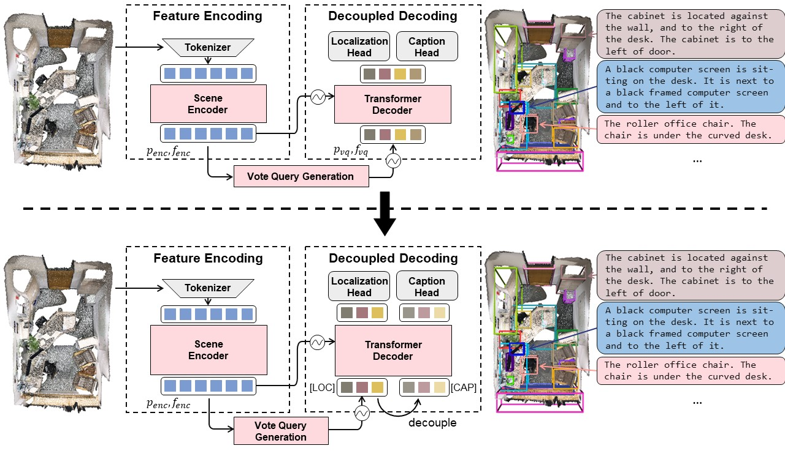
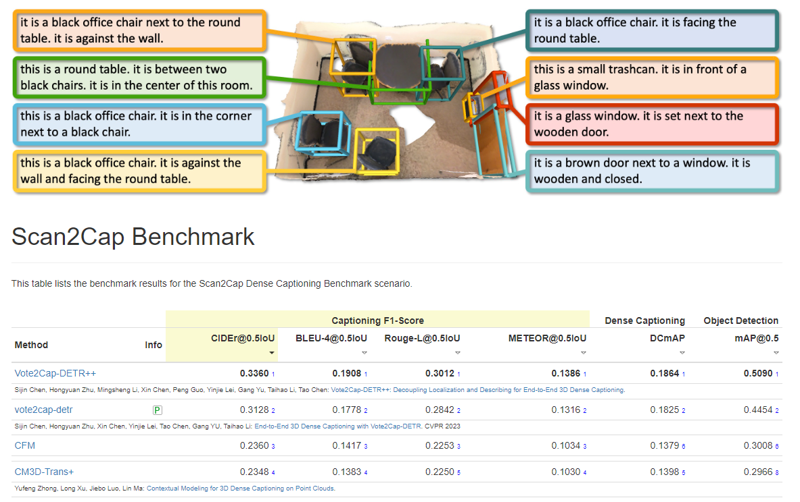

# End-to-End 3D Dense Captioning with Vote2Cap-DETR (CVPR 2023)

Official implementation of ["End-to-End 3D Dense Captioning with Vote2Cap-DETR"](https://arxiv.org/abs/2301.02508) and ["Vote2Cap-DETR++: Decoupling Localization and Describing for End-to-End 3D Dense Captioning"](https://arxiv.org/abs/2309.02999).



Thanks to the implementation of [3DETR](https://github.com/facebookresearch/3detr), [Scan2Cap](https://github.com/daveredrum/Scan2Cap), and [VoteNet](https://github.com/facebookresearch/votenet).


## 0. News

- 2023-09-07. 🤗 We further propose an advanced model at [arXiV](https://arxiv.org/pdf/2309.02999.pdf), and release some of the pre-trained weights at [huggingface](https://huggingface.co/CH3COOK/Vote2Cap-DETR-weights/tree/main).

- 2022-11-17. 🚩 Our model sets a new state-of-the-art on the [Scan2Cap online test benchmark](https://kaldir.vc.in.tum.de/scanrefer_benchmark/benchmark_captioning).




## 1. Environment

Our code is tested with PyTorch 1.7.1, CUDA 11.0 and Python 3.8.13.
Besides `pytorch`, this repo also requires the following Python dependencies:

```{bash}
matplotlib
opencv-python
plyfile
'trimesh>=2.35.39,<2.35.40'
'networkx>=2.2,<2.3'
scipy
cython
transformers
```

If you wish to use multi-view feature extracted by [Scan2Cap](https://github.com/daveredrum/Scan2Cap), you should also install `h5py`:

```{bash}
pip install h5py
```

It is also **REQUIRED** to compile the CUDA accelerated PointNet++ and gIoU support:

```{bash}
cd third_party/pointnet2
python setup.py install
```

```{bash}
cd utils
python cython_compile.py build_ext --inplace
```

To build support for METEOR metric for evaluating captioning performance, we also installed the `java` package.


## 2. Dataset Preparation

We follow [Scan2Cap](https://github.com/daveredrum/Scan2Cap)'s procedure to prepare datasets under the `./data` folder (`Scan2CAD` **NOT** required).

**Prepareing 3D point clouds from ScanNet**. 
Download the [ScanNetV2 dataset](https://github.com/ch3cook-fdu/Vote2Cap-DETR/tree/master/data/scannet) and change the `SCANNET_DIR` to the `scans` folder in [`data/scannet/batch_load_scannet_data.py`](https://github.com/ch3cook-fdu/Vote2Cap-DETR/blob/master/data/scannet/batch_load_scannet_data.py#L16), and run the following commands.

```
cd data/scannet/
python batch_load_scannet_data.py
```

**Prepareing Language Annotations**. 
Please follow [this](https://github.com/daveredrum/ScanRefer) to download the ScanRefer dataset, and put it under `./data`.

[Optional] To prepare for Nr3D, it is also required to [download](https://referit3d.github.io/#dataset) and put the Nr3D under `./data`.
Since it's in `.csv` format, it is required to run the following command to process data.

```{bash}
cd data; python parse_nr3d.py
```

## 3. Download Pretrained Weights

You can download all the ready-to-use weights at [huggingface](https://huggingface.co/CH3COOK/Vote2Cap-DETR-weights/tree/main).


|      Model      |     SCST     |      rgb     |  multi-view  |    normal    | checkpoint |
|:---------------:|:------------:|:------------:|:------------:|:------------:|:----------:|
|  Vote2Cap-DETR  |       -      | $\checkmark$ |       -      | $\checkmark$ | [[checkpoint]](https://huggingface.co/CH3COOK/Vote2Cap-DETR-weights/blob/main/vote2cap-detr/scanrefer_vote2cap_detr_XYZ_RGB_NORMAL.pth) |
|  Vote2Cap-DETR  |       -      |       -      | $\checkmark$ | $\checkmark$ | [[checkpoint]](https://huggingface.co/CH3COOK/Vote2Cap-DETR-weights/blob/main/vote2cap-detr/scanrefer_vote2cap_detr_XYZ_MULTIVIEW_NORMAL.pth) |
|  Vote2Cap-DETR  | $\checkmark$ | $\checkmark$ |       -      | $\checkmark$ | [[checkpoint]](https://huggingface.co/CH3COOK/Vote2Cap-DETR-weights/blob/main/vote2cap-detr/scanrefer_scst_vote2cap_detr_XYZ_RGB_NORMAL.pth) |
|  Vote2Cap-DETR  | $\checkmark$ |       -      | $\checkmark$ | $\checkmark$ | [[checkpoint]](https://huggingface.co/CH3COOK/Vote2Cap-DETR-weights/blob/main/vote2cap-detr/scanrefer_scst_vote2cap_detr_XYZ_MULTIVIEW_NORMAL.pth) |
| Vote2Cap-DETR++ |       -      | $\checkmark$ |       -      | $\checkmark$ | [[checkpoint]](https://huggingface.co/CH3COOK/Vote2Cap-DETR-weights/blob/main/vote2cap-detr++/scanrefer_vote2cap_detr_pp_XYZ_RGB_NORMAL.pth) |
| Vote2Cap-DETR++ |       -      |       -      | $\checkmark$ | $\checkmark$ | [[checkpoint]](https://huggingface.co/CH3COOK/Vote2Cap-DETR-weights/blob/main/vote2cap-detr++/scanrefer_vote2cap_detr_pp_XYZ_MULTIVIEW_NORMAL.pth) |
| Vote2Cap-DETR++ | $\checkmark$ | $\checkmark$ |       -      | $\checkmark$ | [[checkpoint]](https://huggingface.co/CH3COOK/Vote2Cap-DETR-weights/blob/main/vote2cap-detr++/scanrefer_scst_vote2cap_detr_pp_XYZ_RGB_NORMAL.pth) |
| Vote2Cap-DETR++ | $\checkmark$ |       -      | $\checkmark$ | $\checkmark$ | [[checkpoint]](https://huggingface.co/CH3COOK/Vote2Cap-DETR-weights/blob/main/vote2cap-detr++/scanrefer_scst_vote2cap_detr_pp_XYZ_MULTIVIEW_NORMAL.pth) |


## 4. Training and Evaluating your own models

~~Though we provide training commands from scratch, you can also start with some pretrained parameters provided under the `./pretrained` folder and skip certain steps.~~

Because of storage limitations of github, we have uploaded all the pretrained weights to huggingface. It is recommended to download all the files from the [`./pretrained` folder](https://huggingface.co/CH3COOK/Vote2Cap-DETR-weights/tree/main/pretrained) to this repo.

**[optional] 4.0 Pre-Training for Detection**

If you have already downloaded the [`./pretrained` folder](https://huggingface.co/CH3COOK/Vote2Cap-DETR-weights/tree/main/pretrained) from huggingface, you can **SKIP** the following procedures as they are to generate the pre-trained weights in `./pretrained` folder.

To train the Vote2Cap-DETR's detection branch for point cloud input without additional 2D features (aka [xyz + rgb + normal + height])

```{bash}
python main.py --use_color --use_normal --detector detector_Vote2Cap_DETR --checkpoint_dir pretrained/Vote2Cap_DETR_XYZ_COLOR_NORMAL
```

To evaluate the pre-trained detection branch on ScanNet:

```{bash}
python main.py --use_color --use_normal --detector detector_Vote2Cap_DETR --test_ckpt pretrained/Vote2Cap_DETR_XYZ_COLOR_NORMAL/checkpoint_best.pth --test_detection
```

To train with additional 2D features (aka [xyz + multiview + normal + height]) rather than RGB inputs, you can replace `--use_color` to `--use_multiview`.


**4.1 MLE Training for 3D Dense Captioning**

Please make sure there are pretrained checkpoints under the `./pretrained` directory. To train the mdoel for 3D dense captioning with MLE training on ScanRefer:

```{bash}
python main.py --use_color --use_normal --use_pretrained --warm_lr_epochs 0 --pretrained_params_lr 1e-6 --use_beam_search --base_lr 1e-4 --dataset scene_scanrefer --eval_metric caption --vocabulary scanrefer --detector detector_Vote2Cap_DETR --captioner captioner_dcc --checkpoint_dir exp_scanrefer/Vote2Cap_DETR_RGB_NORMAL --max_epoch 720
```

Change `--dataset scene_scanrefer` to `--dataset scene_nr3d` to train the model for the Nr3D dataset.

**4.2 Self-Critical Sequence Training for 3D Dense Captioning**

To train the model with Self-Critical Sequence Training(SCST), you can use the following command:

```{cmd}
python scst_tuning.py --use_color --use_normal --base_lr 1e-6 --detector detector_Vote2Cap_DETR --captioner captioner_dcc --freeze_detector --use_beam_search --batchsize_per_gpu 2 --max_epoch 180 --pretrained_captioner exp_scanrefer/Vote2Cap_DETR_RGB_NORMAL/checkpoint_best.pth --checkpoint_dir exp_scanrefer/scst_Vote2Cap_DETR_RGB_NORMAL
```

Change `--dataset scene_scanrefer` to `--dataset scene_nr3d` to train the model for the Nr3D dataset.

**4.3 Evaluating the Weights**

You can evaluate the trained model in each step by specifying different checkpont directories:

```{cmd}
python main.py --use_color --use_normal --dataset scene_scanrefer --vocabulary scanrefer --use_beam_search --detector detector_Vote2Cap_DETR --captioner captioner_dcc --batchsize_per_gpu 8 --test_ckpt [...]/checkpoint_best.pth --test_caption
```

Change `--dataset scene_scanrefer` to `--dataset scene_nr3d` to train the model for the Nr3D dataset.

## 5. Make Predictions for online test benchmark

Our model also provides prediction codes for ScanRefer online test benchmark.

The following command will generate a `.json` file under the folder defined by `--checkpoint_dir`.

```
python predict.py --use_color --use_normal --dataset test_scanrefer --vocabulary scanrefer --use_beam_search --detector detector_Vote2Cap_DETR --captioner captioner_dcc --batchsize_per_gpu 8 --test_ckpt [...]/checkpoint_best.pth
```

## 6. BibTex

If you find our work helpful, please kindly cite our paper:

```
@inproceedings{chen2023end,
  title={End-to-end 3d dense captioning with vote2cap-detr},
  author={Chen, Sijin and Zhu, Hongyuan and Chen, Xin and Lei, Yinjie and Yu, Gang and Chen, Tao},
  booktitle={Proceedings of the IEEE/CVF Conference on Computer Vision and Pattern Recognition},
  pages={11124--11133},
  year={2023}
}
@misc{chen2023vote2capdetr,
      title={Vote2Cap-DETR++: Decoupling Localization and Describing for End-to-End 3D Dense Captioning}, 
      author={Sijin Chen and Hongyuan Zhu and Mingsheng Li and Xin Chen and Peng Guo and Yinjie Lei and Gang Yu and Taihao Li and Tao Chen},
      year={2023},
      eprint={2309.02999},
      archivePrefix={arXiv},
      primaryClass={cs.CV}
}
```

## 7. License

Vote2Cap-DETR and Vote2Cap-DETR++ are both licensed under a [MIT License](LICENSE).

## 8. Contact

If you have any questions or suggestions about this repo, please feel free to open issues or contact me (csjch3cook@gmail.com)!
