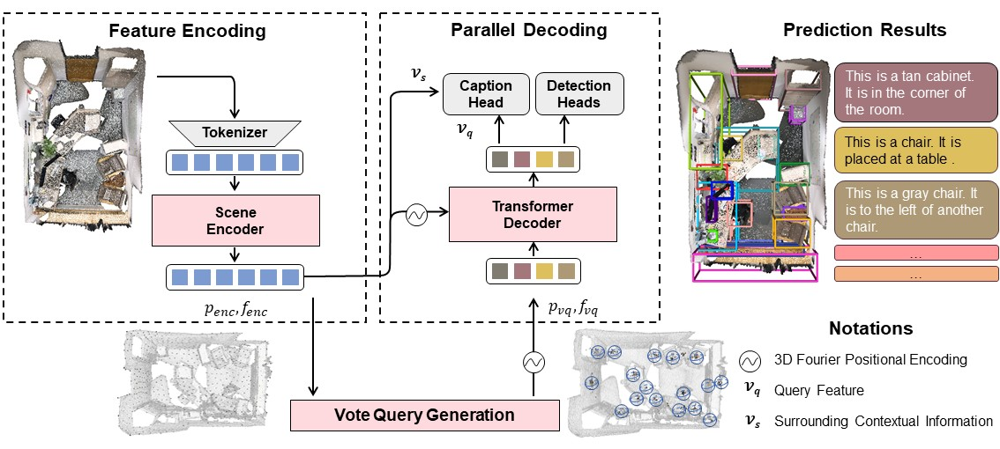

# End-to-End 3D Dense Captioning with Vote2Cap-DETR

## Abstract



Our model sets a new state-of-the-art on the Scan2Cap online test benchmark.

## Dataset Preparation

We follow [Scan2Cap](https://github.com/daveredrum/Scan2Cap)'s procedure to prepare datasets under the `data` folder.
The `Scan2CAD` dataset is not required in this repo.

## Environment

Our code is tested with PyTorch 1.7.1, CUDA 11.0 and Python 3.8.13.
Besides `pytorch`, this repo also requires the following Python dependencies:

```{bash}
matplotlib
opencv-python
plyfile
'trimesh>=2.35.39,<2.35.40'
'networkx>=2.2,<2.3'
scipy
cython
```

It is also **REQUIRED** to install CUDA accelerated PointNet++ and gIoU support:

```{bash}
cd third_party/pointnet2
python setup.py install

cd ../../utils
python cython_compile.py build_ext --inplace
```

To build support for METEOR metric for evaluating captioning performance, we also installed the `java` package.

## Training and Evaluation

Though we provide training commands from scratch, you can also start with some pretrained parameters provided under the `pretrained` folder and skip certain steps.


### Training for Detection [optional]

To train the Vote2Cap-DETR's detection branch for point cloud input without additional 2D features (aka [xyz + rgb + normal + height])

```{bash}
python main.py --use_color --use_normal --detector detector_Vote2Cap_DETR --checkpoint_dir pretrained/Vote2Cap_DETR_XYZ_COLOR_NORMAL
```

To evaluate the pre-trained detection branch:

```{bash}
python main.py --use_color --use_normal --detector detector_Vote2Cap_DETR --test_ckpt pretrained/Vote2Cap_DETR_XYZ_COLOR_NORMAL/checkpoint_best.pth --test_detection
```

To train with additional 2D features (aka [xyz + multiview + normal + height]) rather than RGB inputs:

```{bash}
python main.py --use_multiview --use_normal --detector detector_Vote2Cap_DETR --checkpoint_dir pretrained/Vote2Cap_DETR_XYZ_MULTIVIEW_NORMAL
```

**Note:** we also provide support for training and testing the VoteNet baseline by changing to `--detector detector_votenet` and also remember to modify the `checkpoint_dir`.


### Training for 3D Dense Captioning [required]

Before training for 3D dense captioning, remember to check whether there exists pretrained weights for detection branch under `./pretrained/`. 

### MLE Training

The MLE training supervises the model to generate $w^{t}$ given previous words $w^{1:t-1}$ and visual clue $\mathcal{V}$ with standard cross entropy loss. To tune the detector for captioning on ScanRefer:

```{bash}
python main.py --use_color --use_normal --use_pretrained --warm_lr_epochs 0 --pretrained_params_lr 1e-6 --use_beam_search --base_lr 1e-4 --dataset scene_scanrefer --eval_metric caption --vocabulary scanrefer --detector detector_Vote2Cap_DETR --captioner captioner_dcc --checkpoint_dir exp_scanrefer/Vote2Cap_DETR_rgb --max_epoch 720
```

Also you can evaluate the trained model with:

```{bash}
python main.py --use_color --use_normal --dataset scene_scanrefer --vocabulary scanrefer --use_beam_search --detector detector_Vote2Cap_DETR --captioner captioner_dcc --test_ckpt exp_scanrefer/Vote2Cap_DETR_rgb/checkpoint_best.pth --test_caption
```

### Tuning Caption head with Self-Critical Sequence Training [optional]

To tune the model with SCST, you can train with:

```{cmd}
python scst_tuning.py --use_color --use_normal --base_lr 1e-6 --detector detector_Vote2Cap_DETR --captioner captioner_dcc --freeze_detector --use_beam_search --batchsize_per_gpu 2 --max_epoch 180 --pretrained_captioner exp_scanrefer/Vote2Cap_DETR_rgb/checkpoint_best.pth --checkpoint_dir exp_scanrefer/scst_Vote2Cap_DETR_rgb
```

and also evaluate the trained model:

```{cmd}
python main.py --use_color --use_normal --dataset scene_scanrefer --vocabulary scanrefer --use_beam_search --detector detector_Vote2Cap_DETR --captioner captioner_dcc --batchsize_per_gpu 8 --test_ckpt exp_scanrefer/scst_Vote2Cap_DETR_rgb/checkpoint_best.pth --test_caption
```

We also provide support for training and evaluating the network with all the above listed commands on the Nr3D dataset by changing `--dataset scene_scanrefer` to `--dataset scene_nr3d`. 
Please **make sure** that:

1. the defined model is the same as the checkpoint's.
2. the test dataset is from the same source as the checkpoint's.


## Prediction for online test benchmark

The following command will generate a `.json` file under the folder of `checkpoint_dir`.

```
python predict.py --use_color --use_normal --dataset test_scanrefer --vocabulary scanrefer --use_beam_search --detector detector_Vote2Cap_DETR --captioner captioner_dcc --batchsize_per_gpu 8 --test_ckpt [...]/checkpoint_best.pth --test_caption
```